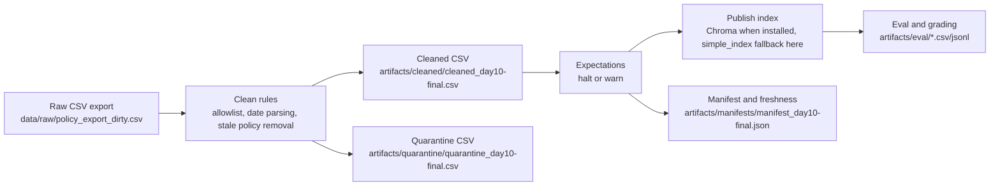

# Pipeline Architecture - Lab Day 10

**Group:** PLACEHOLDER_GROUP  
**Updated:** 2026-06-10  
**Final run_id:** `day10-final`

## 1. Flow

## 2. Boundaries

| Component | Input | Output | Owner |
|---|---|---|---|
| Ingest | Raw CSV export | Raw record count and run log | Ingestion / Raw Owner |
| Transform | Raw rows | Cleaned rows and quarantine rows | Cleaning & Quality Owner |
| Quality | Cleaned rows | Expectation results and controlled halt | Cleaning & Quality Owner |
| Embed | Cleaned CSV | Chroma collection or `artifacts/simple_index/day10_kb.json` fallback | Embed Owner |
| Monitor | Manifest | PASS/WARN/FAIL freshness result | Monitoring / Docs Owner |

## 3. Idempotency and Rerun

The pipeline uses stable `chunk_id` values generated from `doc_id`, cleaned text, and sequence. When Chroma is available, the publish step upserts by `chunk_id` and prunes ids not present in the current cleaned snapshot. In this environment Chroma was not installed, so the pipeline wrote a deterministic simple lexical index at `artifacts/simple_index/day10_kb.json`; rerunning `day10-final` overwrites the same index path and keeps record counts stable at 247 raw, 37 cleaned, and 210 quarantined.

## 4. Day 09 Connection

Day 09 agents depend on retrieval returning the current knowledge-base version. This Day 10 pipeline protects that layer by removing stale refund and HR chunks before publish, adding the missing `access_control_sop` source, and producing eval evidence before the agent layer reads the corpus.

## 5. Known Risks

- The sample data is stale relative to the current clock, so freshness returns `FAIL` under the 24-hour SLA.
- The current environment could not install Chroma in time, so the fallback index was used for verification. The Chroma path remains supported when dependencies are available.
